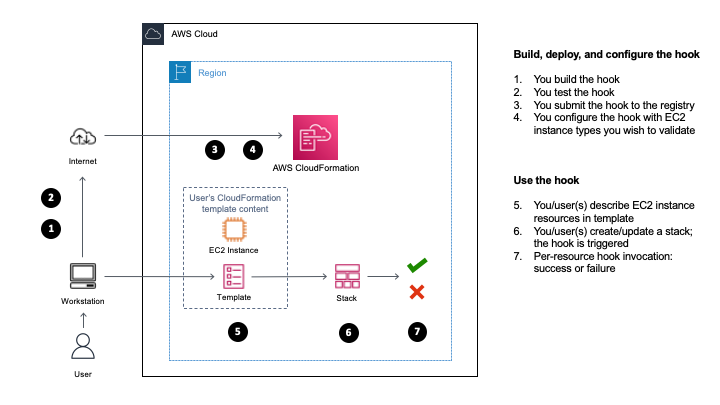

# AWSSamples::EC2InstanceTypes::Hook

- [Overview](#Overview)

- [Usage](#Usage)

- [Hook Deployment with StackSets](#Hook-Deployment-with-StackSets)

- [Tests](#Tests)

  - [Unit tests](#Unit-tests)

  - [Contract tests](#Contract-tests)

  - [Sample templates](#Sample-templates)

- [Hook development notes](#Hook-development-notes)


## Overview

This is an example hook for [AWS CloudFormation](https://aws.amazon.com/cloudformation/), that demonstrates verification for [Amazon EC2 instance types](https://aws.amazon.com/ec2/instance-types/) you wish to use and allow for your workload.  This sample hook is designed to look at a number of [resource types](https://docs.aws.amazon.com/AWSCloudFormation/latest/UserGuide/aws-template-resource-type-ref.html), that include a number of resource types whose configuration you describe in your CloudFormation template.  Supported resource types in this example hook are:

- `AWS::AutoScaling::LaunchConfiguration` (see note)
- `AWS::Cloud9::EnvironmentEC2`
- `AWS::EC2::CapacityReservationFleet`
- `AWS::EC2::CapacityReservation`
- `AWS::EC2::Host` (see note)
- `AWS::EC2::Instance`
- `AWS::EC2::LaunchTemplate`

Note for the `AWS::AutoScaling::LaunchConfiguration` resource type: as per the important note on this [page](https://docs.aws.amazon.com/autoscaling/ec2/userguide/launch-configurations.html), it is strongly recommended that you do not use launch configurations, whose information are provided to users who have not yet migrated to launch templates.  For more information, see [Amazon EC2 Auto Scaling will no longer add support for new EC2 features to Launch Configurations](https://aws.amazon.com/blogs/compute/amazon-ec2-auto-scaling-will-no-longer-add-support-for-new-ec2-features-to-launch-configurations/).

Note: when you describe the `AWS::EC2::Host` [resource type](https://docs.aws.amazon.com/AWSCloudFormation/latest/UserGuide/aws-resource-ec2-host.html) in your CloudFormation template(s), you have the choice of specifying either the `InstanceType` [property](https://docs.aws.amazon.com/AWSCloudFormation/latest/UserGuide/aws-resource-ec2-host.html#cfn-ec2-host-instancetype), or the `InstanceFamily` [property](https://docs.aws.amazon.com/AWSCloudFormation/latest/UserGuide/aws-resource-ec2-host.html#cfn-ec2-host-instancefamily).  If you specify a value for `InstanceFamily` in your template, and you then create/update your stack with the template, this sample hook is triggered (assuming you have configured this hook for this - see the usage section below), and will still use the values you specify in the hook's configuration for `EC2InstanceTypes` to perform the validation, but will only consider the sub-string to the left of the `.` character.  For example, if you specify to allow-list `t1.micro` and `t2.micro` instance types in this hook's configuration, this hook will validate the value you specify for `InstanceFamily` in your template for the `AWS::EC2::Host` resource type against `t1` and `t2` instance families.

For more information on developing hooks, see [Developing hooks](https://docs.aws.amazon.com/cloudformation-cli/latest/userguide/hooks.html).

A diagram with build, deployment, and usage workflows for this hook is shown next:




## Usage

First, make sure you install the [CloudFormation CLI](https://docs.aws.amazon.com/cloudformation-cli/latest/userguide/what-is-cloudformation-cli.html).  Next, to evaluate this hook in your account, package and submit it:

```shell
cfn generate && mvn clean package && cfn submit --set-default
```

Next, configure this hook.  Create a `type_config.json` file with the hook configuration, as shown next; note the `Properties` section, where you'll need to configure comma-delimited EC2 instance types you require in `EC2InstanceTypes`:

```shell
cat <<EOF > type_config.json
{
    "CloudFormationConfiguration": {
        "HookConfiguration": {
            "TargetStacks": "ALL",
            "FailureMode": "FAIL",
            "Properties": {
                "EC2InstanceTypes": "t1.micro,t2.micro,"
            }
        }
    }
}
EOF
```

The example above uses `t1.micro`, `t2.micro` as sample values to illustrate usage.  For more information, see [Amazon EC2 instance types](https://aws.amazon.com/ec2/instance-types/).  You can also choose to use the [AWS Command Line Interface](https://docs.aws.amazon.com/cli/latest/userguide/cli-chap-welcome.html) (AWS CLI) for example, to list instance types with the `describe-instance-types` [command](https://awscli.amazonaws.com/v2/documentation/api/latest/reference/ec2/describe-instance-types.html), as shown below:

```shell
aws ec2 describe-instance-types --query 'InstanceTypes[*].InstanceType'
```

When you specify values for `EC2InstanceTypes` mentioned above: if any, trailing commas and spaces between values are ignored.  If you specify non-existent instance types in the configuration above, this sample hook does not validate the correctness of such values.

If you specify duplicate values in the `EC2InstanceTypes` configuration, the sample logic in this hook will remove the duplicates, and keep only unique values.  For example, this configuration snippet: `"EC2InstanceTypes": "t1.micro,t2.micro,t2.micro,t1.micro,t2.micro,t2.micro"` will be parsed as if it were: `"EC2InstanceTypes": "t1.micro,t2.micro"`.

Next, get the hook's [Amazon Resource Name](https://docs.aws.amazon.com/general/latest/gr/aws-arns-and-namespaces.html) (ARN):

```shell
aws cloudformation list-types \
  --type HOOK \
  --filters TypeNamePrefix=AWSSamples::EC2InstanceTypes::Hook \
  --query 'TypeSummaries[?TypeName==`AWSSamples::EC2InstanceTypes::Hook`].TypeArn' \
  --output text
```

Use the value returned in the output above, and pass it to this command:

```shell
aws cloudformation set-type-configuration \
  --configuration file://type_config.json \
  --type-arn 'YOUR_HOOK_ARN'
```


## Hook Deployment with StackSets
You can choose to use [StackSets](https://docs.aws.amazon.com/AWSCloudFormation/latest/UserGuide/what-is-cfnstacksets.html) to make this hook available in other regions for your account.  For this, you can choose to use the `examples/hook-deployment-stack.yaml` sample CloudFormation template that describes deployment-related resources for this hook with code, and then use StackSets to deploy the hook across AWS regions you need.  To get started, follow steps shown next:

- Create a stack with the `examples/hook-deployment-bucket.yaml` sample template, that describes an [Amazon Simple Storage Service](https://aws.amazon.com/s3/) (Amazon S3) bucket where you will store the hook archive file you'll generate, and the `examples/hook-deployment-stack.yaml` template file that you will use with StackSets.  Choose a stack creation method, such as via the AWS CloudFormation console, or the AWS Command Line interface: for more information, see [Working with stacks](https://docs.aws.amazon.com/AWSCloudFormation/latest/UserGuide/stacks.html).

- When done, navigate to the **Outputs** tab for your stack in the AWS CloudFormation console, and note the value for the `BucketName` output key: this is the name of the bucket you created in the previous step, and you will use this bucket next.

- Next, create the ZIP archive for this hook content with the following commands:

```shell
cfn generate && mvn clean package && cfn submit --dry-run
```

- The last command above should have created the `awssamples-ec2instancetypes-hook.zip` archive in the same directory as this `README.md` file.  Upload the ZIP archive to the bucket whose name you noted earlier.  Use a method of your choice, such as the S3 console or the AWS CLI; for more information, see [Uploading objects](https://docs.aws.amazon.com/AmazonS3/latest/userguide/upload-objects.html).

- Next, upload the `hook-deployment-stack.yaml` template file - that you can find in the `examples/` directory - to your bucket as well.

- In this next step, prepare your account for it to work with StackSets, by referring to [Prerequisites for stack set operations](https://docs.aws.amazon.com/AWSCloudFormation/latest/UserGuide/stacksets-prereqs.html).  For example, if you choose to use [Self-managed permissions](https://docs.aws.amazon.com/AWSCloudFormation/latest/UserGuide/stacksets-prereqs-self-managed.html#prereqs-self-managed-permissions), refer to [Set up basic permissions for stack set operations](https://docs.aws.amazon.com/AWSCloudFormation/latest/UserGuide/stacksets-prereqs-self-managed.html#stacksets-prereqs-accountsetup) to create `AWSCloudFormationStackSetAdministrationRole` and `AWSCloudFormationStackSetExecutionRole` roles with provided templates.

- Next, [create](https://docs.aws.amazon.com/AWSCloudFormation/latest/UserGuide/stacksets-getting-started-create.html) your StackSet.  As an example, the following process describes next steps if you choose to use the AWS CloudFormation [console](https://console.aws.amazon.com/cloudformation/) and [self-managed permissions](https://docs.aws.amazon.com/AWSCloudFormation/latest/UserGuide/stacksets-getting-started-create.html).

- From the navigation pane in the console, choose **StackSets**, and then **Create StackSet**.

- In the next page, choose to use **Self-service permissions** and, where indicated, specify the names of the roles you created previously (`AWSCloudFormationStackSetAdministrationRole`, and `AWSCloudFormationStackSetExecutionRole` respectively).

- In the **Prerequisite - Prepare template** section, specify the Amazon S3 URL of the `hook-deployment-stack.yaml` template you uploaded to your bucket earlier.  Alternatively, choose to upload the `hook-deployment-stack.yaml` template file.

- Specify a name for your StackSet.

- Specify parameter values you require for the hook configuration.  For the `SchemaHandlerPackage` parameter, specify the URL of the ZIP file you uploaded to your bucket earlier.  Choose **Next** when done specifying parameter values.

- In **Execution configuration**, choose `Active` for **Managed execution**.  Choose **Next**.

- Specify your account ID number in the **Account numbers** section for **Accounts**.

- In the **Regions** section, specify regions where you wish to deploy this hook.

- In **Deployment options**, choose `Parallel` for **Region Concurrency**.  Choose **Next**.

- In the **Review** page, review your selections.  Choose **I acknowledge that AWS CloudFormation might create IAM resources** at the bottom of the page, and choose **Submit**.

- Your StackSet creation process should start shortly; you can review the status in the **Operations** pane in **StackSet details**.

At the end of the process, your hook should have been deployed into target regions you chose earlier.


## Tests

Information on example unit tests for this sample hook, as well as on sample templates to test the hook, is shown next.


### Unit tests

To run sample unit tests in `src/test` and verify code coverage, run:

```shell
mvn clean verify
```


### Contract tests

Contract tests help you validate hooks you develop work as you expect.  Moreover, your hook must pass contract tests before being published.  For more information on requirements, see [Testing registered hooks](https://docs.aws.amazon.com/cloudformation-cli/latest/userguide/hooks-publishing.html#hooks-testing-registered-hooks).

To run contract tests for this hook, first set up a retry configuration in your `~/.aws/config` global AWS configuration file.  Assuming you use a `default` profile, update your file by integrating the example configuration lines for `retry_mode` and `max_attempts` as shown next:

```
[default]
retry_mode = standard
max_attempts = 15
```

For more information on retry modes, see [AWS CLI retries](https://docs.aws.amazon.com/cli/latest/userguide/cli-configure-retries.html).

Next, let's test this hook locally with contract tests; run:

```shell
sam local start-lambda
```

in your terminal to get started.  For more information, see [Testing resource types locally using AWS SAM](https://docs.aws.amazon.com/cloudformation-cli/latest/userguide/resource-type-test.html#resource-type-develop-test).

Next, in another terminal, run following commands to create a `~/.cfn-cli/` directory in your home directory, set up the configuration file for the hook (by copying the existing `type_config.json` file for this hook into `~/.cfn-cli/typeConfiguration.json`), and then generate, package, and run contract tests:

```shell
mkdir ~/.cfn-cli/
cp type_config.json ~/.cfn-cli/typeConfiguration.json
cfn generate && mvn clean package && cfn test -v --enforce-timeout 90
```


## Sample templates

The `examples` directory contains example templates you can choose to use to test the hook's behavior, including an `example-resources.template` file that contains a number of resource types.


## Hook development notes

1. Write the JSON schema describing your hook, `awssamples-ec2instancetypes-hook.json`
1. Implement your hook handlers.

The RPDK will automatically generate the correct hook input model from the schema whenever the project is built via Maven. You can also do this manually with the following command: `cfn generate`.

> Please don't modify files under `target/generated-sources/rpdk`, as they will be automatically overwritten.

The code uses [Lombok](https://projectlombok.org/), and [you may have to install IDE integrations](https://projectlombok.org/) to enable auto-complete for Lombok-annotated classes.
