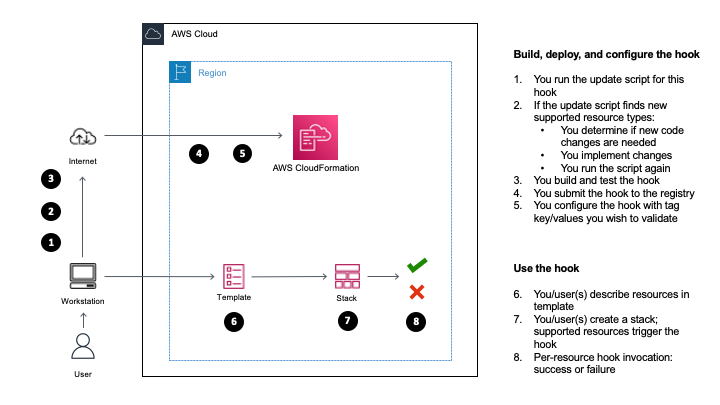

# AWSSamples::ResourceTags::Hook

- [Overview](#Overview)

- [Usage](#Usage)

- [Hook Deployment with StackSets](#Hook-Deployment-with-StackSets)

- [Updating the hook](#Updating-the-hook)

- [Tests](#Tests)

  - [Unit tests](#Unit-tests)

  - [Contract tests](#Contract-tests)

  - [Sample templates](#Sample-templates)

- [Hook development notes](#Hook-development-notes)

  - [Type hints](#Type-hints)


## Overview

This is an example hook for [AWS CloudFormation](https://aws.amazon.com/cloudformation/), that demonstrates validation of tags you require for resource types that support tags, and that are supported in this example hook as well.  By default, the hook uses AWS resource types: you have the choice of using third-party, registered, and activated resource types as well (see the section on updating the hook for more information).  This sample hook demonstrates following validations:

  - tag keys you require are specified;
  - values for all tag keys, including non-required keys, are non-empty;
  - tag values are included in allowed values you specify;
  - tag propagation properties are set for supported resource types (resource-level tags only).

For more information on developing hooks, see [Developing hooks](https://docs.aws.amazon.com/cloudformation-cli/latest/userguide/hooks.html).

A diagram with build, deployment, and usage workflows for this hook is shown next:




## Usage

First, make sure you install the [CloudFormation CLI](https://docs.aws.amazon.com/cloudformation-cli/latest/userguide/what-is-cloudformation-cli.html).  Next, to evaluate this hook in your account, package and submit it:

```shell
cfn generate && cfn submit --dry-run && cfn submit --set-default
```

Next, configure this hook.  Create a `type_config.json` file with the hook configuration, as shown next; note the `Properties` section, where you'll need to configure comma-delimited tags keys you require in `TagKeys`, as well as either `resource` (default) or `stack` for `ValidationStrategy` (that is, whether this hook reads tag key/values you specify, for supported resources, in either your CloudFormation template for a given resource or at the stack level):

```shell
cat <<EOF > type_config.json
{
    "CloudFormationConfiguration": {
        "HookConfiguration": {
            "TargetStacks": "ALL",
            "FailureMode": "FAIL",
            "Properties": {
                "TagKeys": "Name,",
                "ValidationStrategy": "resource"
            }
        }
    }
}
EOF
```

Note that since the default value for `ValidationStrategy` is `resource`, when you choose to use this value you can also choose to omit the `"ValidationStrategy": "resource"` line altogether.

If you choose the `stack` validation strategy: note that stack-level tags propagation to resources can vary by resource.  For more information, see [Resource tag](https://docs.aws.amazon.com/AWSCloudFormation/latest/UserGuide/aws-properties-resource-tags.html).

The example above uses `Name` as a tag key you require.  You can also, optionally, choose to specify allowed values for keys you require, with the following syntax:

- use `=` to separate the key from allowed values, and
- `|` to separate each allowed value from the next one.

Please note: if you need to specify characters such as `=`, `,`, and `|` as part of your keys or values content (for example, you have a tag whose value is: `This=is,your,tag|value`), you will need to escape such characters with a backslash character: `\`.  When you do so, you will also need to escape the backslash you add, for it to work with the JSON input format for the hook's configuration.  For example:

```
                "TagKeys": "ThisIsYourKey=This\\=is\\,your\\,tag\\|value",
```

Allowed values can also contain one or more regular expression preceded by the `regexp:` token, and followed by the regular expression itself.

The following example shows the intent of requiring the `Name` tag key with no allowed values, the `Env` tag key with `dev`, `qa`, and `prod` allowed values, and with a regular expression indicating a desired match of one or more lowercase characters:

```
                "TagKeys": "Name,Env=|dev|qa|prod|regexp:^[a-z]+$|,",
```

You can also specify values with whitespace characters around assignments, and in between comma-delimited values and allowed values, without leading or trailing vertical bar (`|`) characters, and without a trailing comma at the end of the `TagKeys` configuration:

```
                "TagKeys": "Name, Env = dev | qa | prod | regexp:^[a-z]+$",
```

When you specify adjacent delimiters such as `==`, `,,`, or `||` (or separated with a whitespace), this hook will return a parsing failure.

Next, get the hook's [Amazon Resource Name](https://docs.aws.amazon.com/general/latest/gr/aws-arns-and-namespaces.html) (ARN):

```shell
aws cloudformation list-types \
  --type HOOK \
  --filters TypeNamePrefix=AWSSamples::ResourceTags::Hook \
  --query 'TypeSummaries[?TypeName==`AWSSamples::ResourceTags::Hook`].TypeArn' \
  --output text
```

Use the value returned in the output above, and pass it to this command:

```shell
aws cloudformation set-type-configuration \
  --configuration file://type_config.json \
  --type-arn 'YOUR_HOOK_ARN'
```


## Hook Deployment with StackSets
You can choose to use [StackSets](https://docs.aws.amazon.com/AWSCloudFormation/latest/UserGuide/what-is-cfnstacksets.html) to make this hook available in other regions for your account.  For this, you can choose to use the `examples/hook-deployment-stack.yaml` sample CloudFormation template that describes deployment-related resources for this hook with code, and then use StackSets to deploy the hook across AWS regions you need.  To get started, follow steps shown next:

- Create a stack with the `examples/hook-deployment-bucket.yaml` sample template, that describes an [Amazon Simple Storage Service](https://aws.amazon.com/s3/) (Amazon S3) bucket where you will store the hook archive file you'll generate, and the `examples/hook-deployment-stack.yaml` template file that you will use with StackSets.  Choose a stack creation method, such as via the AWS CloudFormation console, or the AWS Command Line interface: for more information, see [Working with stacks](https://docs.aws.amazon.com/AWSCloudFormation/latest/UserGuide/stacks.html).

- When done, navigate to the **Outputs** tab for your stack in the AWS CloudFormation console, and note the value for the `BucketName` output key: this is the name of the bucket you created in the previous step, and you will use this bucket next.

- Next, create the ZIP archive for this hook content with the following commands:

```shell
cfn generate && cfn submit --dry-run
```

- The last command above should have created the `awssamples-resourcetags-hook.zip` archive in the same directory as this `README.md` file.  Upload the ZIP archive to the bucket whose name you noted earlier.  Use a method of your choice, such as the S3 console or the AWS CLI; for more information, see [Uploading objects](https://docs.aws.amazon.com/AmazonS3/latest/userguide/upload-objects.html).

- Next, upload the `hook-deployment-stack.yaml` template file - that you can find in the `examples/` directory - to your bucket as well.

- In this next step, prepare your account for it to work with StackSets, by referring to [Prerequisites for stack set operations](https://docs.aws.amazon.com/AWSCloudFormation/latest/UserGuide/stacksets-prereqs.html).  For example, if you choose to use [Self-managed permissions](https://docs.aws.amazon.com/AWSCloudFormation/latest/UserGuide/stacksets-prereqs-self-managed.html#prereqs-self-managed-permissions), refer to [Set up basic permissions for stack set operations](https://docs.aws.amazon.com/AWSCloudFormation/latest/UserGuide/stacksets-prereqs-self-managed.html#stacksets-prereqs-accountsetup) to create `AWSCloudFormationStackSetAdministrationRole` and `AWSCloudFormationStackSetExecutionRole` roles with provided templates.

- Next, [create](https://docs.aws.amazon.com/AWSCloudFormation/latest/UserGuide/stacksets-getting-started-create.html) your StackSet.  As an example, the following process describes next steps if you choose to use the AWS CloudFormation [console](https://console.aws.amazon.com/cloudformation/) and [self-managed permissions](https://docs.aws.amazon.com/AWSCloudFormation/latest/UserGuide/stacksets-getting-started-create.html).

- From the navigation pane in the console, choose **StackSets**, and then **Create StackSet**.

- In the **Prerequisite - Prepare template** section, specify the Amazon S3 URL of the `hook-deployment-stack.yaml` template you uploaded to your bucket earlier.  Alternatively, choose to upload the `hook-deployment-stack.yaml` template file.

- Specify a name for your StackSet, for example: `AWSSamples-ResourceTags-Hook-deployment`.

- Specify parameter values you require for the hook configuration.  For the `SchemaHandlerPackage` parameter, specify the URL of the ZIP file you uploaded to your bucket earlier.  Choose **Next** when done specifying parameter values.

- In **Execution configuration**, choose `Active` for **Managed execution**.  Choose **Next**.

- Specify your account number in the **Account numbers** section for **Accounts**.

- In the **Regions** section, specify regions where you wish to deploy this hook.

- In **Deployment options**, choose `Parallel` for **Region Concurrency**.  Choose **Next**.

- In the **Review** page, review your selections.  Choose **I acknowledge that AWS CloudFormation might create IAM resources** at the bottom of the page, and choose **Next**.

- Your StackSet creation process should start shortly; you can review the status in the **Operations** pane in **StackSet details**.

At the end of the process, your hook should have been deployed into target regions you chose earlier.


## Updating the hook

This hook comes with a sample `update_hook.py` script to update resource type-related data stored in the `src/awssamples_resourcetags_hook/targets_info.json` generated data file, and in the `awssamples-resourcetags-hook.json` schema file for the hook.  The script uses a best-effort logic to search, at the root level of properties for a given resource, for properties that are related to user-configurable tags (e.g., the `Tags` property for the `AWS::S3::Bucket` resource type), as well as tag propagation (e.g., `PropagateTags` for `AWS::ECS::Service`).

By default, the update script uses AWS types for the category to search for resource types.  Optionally, you can choose to use additional categories by uncommenting relevant lines; an example configuration excerpt from the `update_hook.py` script follows next:

```python
RESOURCE_TYPE_CATEGORIES = [
    "AWS_TYPES",
    # "THIRD_PARTY",
    # "REGISTERED",
    # "ACTIVATED",
]
```

For more information, see _Filters_ and _Category_ in the [list_types()](https://boto3.amazonaws.com/v1/documentation/api/latest/reference/services/cloudformation.html#CloudFormation.Client.list_types) Boto3 documentation.

When ready to update the hook, run the following script from the project's root directory:

```shell
./update_hook.py
```

When the update is finished, compare the `awssamples-resourcetags-hook.json` file, and files in the `inputs/` directory, with respective previous versions.  Note if new resources have been found, and verify in the [AWS resource and property types reference](https://docs.aws.amazon.com/AWSCloudFormation/latest/UserGuide/aws-template-resource-type-ref.html) that property types discovered by the update script are the tag-related properties you need for the new, given resource type.  If you wish to exclude a new property for a given resource type, do so in the `src/awssamples_resourcetags_hook/ignored_targets_info.json` file, and then run the update script again to patch the schema file and contract tests input files.  The expected format for the `src/awssamples_resourcetags_hook/ignored_targets_info.json` file is:

```json
[
    {
        "name": "RESOURCE_TYPE_NAME",
        "ignored_target_properties": [
            {
                "property_name": "RESOURCE_PROPERTY_NAME_1"
            },
            {
                "property_name": "RESOURCE_PROPERTY_NAME_2"
            }
        ]
    }
]
```

You can also use the same structure above to add propagation properties that the script detected, and that are not related to tags.

Once you are finished with updating hook's data files, package and re-submit the hook:

```shell
cfn generate && cfn submit --dry-run && cfn submit --set-default
```


## Tests

Information on example unit tests for this sample hook, as well as on sample templates to test the hook, is shown next.


### Unit tests

To run sample unit tests in `src/awssamples_resourcetags_hook/tests`, you'll need [pytest](https://docs.pytest.org/) and [pytest-cov](https://pytest-cov.readthedocs.io/en/latest/).  Follow steps shown next to install `pytest`, `pytest-cov`, as well as `cloudformation-cli-python-lib` that is used in sample unit tests with `pip`:

```shell
pip install pytest-cov
pip install cloudformation-cli-python-lib
```

Note the `.coveragerc` file, that is in the same directory of this `README.md` file: this file is used to omit a number of paths from test operations, and to set unit tests preferences.

Next, make sure you are in the same directory of this `README.md` file, and run unit tests:

```shell
pytest --cov
```


### Contract tests

Contract tests help you validate hooks you develop work as you expect.  Moreover, your hook must pass contract tests before being published.  For more information on requirements, see [Testing registered hooks](https://docs.aws.amazon.com/cloudformation-cli/latest/userguide/hooks-publishing.html#hooks-testing-registered-hooks).

To run contract tests for this hook, first set up a retry configuration in your `~/.aws/config` global AWS configuration file.  Assuming you use a `default` profile, update your file by integrating the example configuration lines for `retry_mode` and `max_attempts` as shown next:

```
[default]
retry_mode = standard
max_attempts = 15
```

For more information on retry modes, see [AWS CLI retries](https://docs.aws.amazon.com/cli/latest/userguide/cli-configure-retries.html).

Next, let's test this hook locally with contract tests; run:

```shell
sam local start-lambda
```

in your terminal to get started.  For more information, see [Testing resource types locally using AWS SAM](https://docs.aws.amazon.com/cloudformation-cli/latest/userguide/resource-type-test.html#resource-type-develop-test).

Next, in another terminal, run following commands to create a `~/.cfn-cli/` directory in your home directory, set up the configuration file for the hook (by copying the existing `type_config.json` file for this hook into `~/.cfn-cli/typeConfiguration.json`), and then generate, package, and run contract tests:

```shell
mkdir ~/.cfn-cli/
cp type_config.json ~/.cfn-cli/typeConfiguration.json
cfn generate && cfn submit --dry-run && cfn test
```


## Sample templates

The `examples` directory contains example templates you can choose to use to test the hook's behavior, for no-resource-tags and with-resource-tags use cases for resource types including `AWS::S3::Bucket`, `AWS::SSM::Parameter`, `AWS::EC2::LaunchTemplate`, and `AWS::AutoScaling::AutoScalingGroup`.


## Hook development notes

1. Write the JSON schema describing your resource, `awssamples-resourcetags-hook.json`
2. Implement your resource handlers in `awssamples_resourcetags_hook/handlers.py`

> Don't modify `models.py` by hand, any modifications will be overwritten when the `generate` or `package` commands are run.

Implement CloudFormation resource here. Each function must always return a ProgressEvent.

```python
ProgressEvent(
    # Required
    # Must be one of OperationStatus.IN_PROGRESS, OperationStatus.FAILED, OperationStatus.SUCCESS
    status=OperationStatus.IN_PROGRESS,
    # Required on SUCCESS (except for LIST where resourceModels is required)
    # The current resource model after the operation; instance of ResourceModel class
    resourceModel=model,
    resourceModels=None,
    # Required on FAILED
    # Customer-facing message, displayed in e.g. CloudFormation stack events
    message="",
    # Required on FAILED: a HandlerErrorCode
    errorCode=HandlerErrorCode.InternalFailure,
    # Optional
    # Use to store any state between re-invocation via IN_PROGRESS
    callbackContext={},
    # Required on IN_PROGRESS
    # The number of seconds to delay before re-invocation
    callbackDelaySeconds=0,
)
```

Failures can be passed back to CloudFormation by either raising an exception from `cloudformation_cli_python_lib.exceptions`, or setting the ProgressEvent's `status` to `OperationStatus.FAILED` and `errorCode` to one of `cloudformation_cli_python_lib.HandlerErrorCode`. There is a static helper function, `ProgressEvent.failed`, for this common case.


### Type hints

We hope they'll be useful for getting started quicker with an IDE that support type hints. Type hints are optional - if your code doesn't use them, it will still work.
