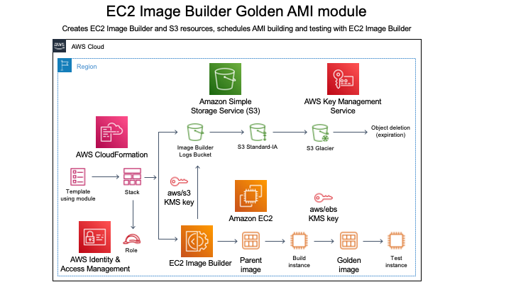

# EC2 Image Builder GoldenAMI module


- [Overview](#Overview)

- [Module usage](#Module-usage)

  - [Module input parameters](#Module-input-parameters)

  - [Declaring the module in your
    template](#Declaring-the-module-in-your-template)

  - [Example template that uses the
    module](#Example-template-that-uses-the-module)

- [Default values used and choices made in the
  module](#Default-values-used-and-choices-made-in-the-module)


## Overview
_EC2 Image Builder GoldenAMI_ is a module for [AWS
CloudFormation](https://aws.amazon.com/cloudformation/) that leverages
[EC2 Image Builder](https://aws.amazon.com/image-builder/) to create
and test Linux or Windows Server images with a pipeline running on a
schedule.  The module offers a minimal set of input parameters and
example, opinionated default values and choices discussed further
below.  When specifying input parameters, you choose which [Amazon
Machine
Image](https://docs.aws.amazon.com/AWSEC2/latest/UserGuide/AMIs.html)
(AMI) you wish to use as the parent image.  The module references the
latest version of each parent image by specifying a
[wildcard](https://docs.aws.amazon.com/imagebuilder/latest/APIReference/API_CreateImageRecipe.html#imagebuilder-CreateImageRecipe-request-parentImage)
in the
[recipe](https://docs.aws.amazon.com/AWSCloudFormation/latest/UserGuide/aws-resource-imagebuilder-imagerecipe.html)
the module uses to build your golden image.

A diagram with architecture and flow is shown next:



The flow can be summarized as follows:

- you declare the _EC2 Image Builder GoldenAMI_ module in your
  CloudFormation template.  You specify input parameters for the
  module, such as the parent image you wish to use, as well as the
  name of the organization and of the business unit (both used for
  tagging of resources the module creates)

- you [create a CloudFormation
  stack](https://docs.aws.amazon.com/AWSCloudFormation/latest/UserGuide/cfn-console-create-stack.html)
  using your template

- the stack uses the module you declared in your template to create a
  number of
  [ImageBuilder](https://docs.aws.amazon.com/AWSCloudFormation/latest/UserGuide/AWS_ImageBuilder.html)
  resources (such as `AWS::ImageBuilder::ImagePipeline`,
  `AWS::ImageBuilder::ImageRecipe`,
  `AWS::ImageBuilder::InfrastructureConfiguration`,
  `AWS::ImageBuilder::DistributionConfiguration`), as well as an
  [Amazon S3
  bucket](https://docs.aws.amazon.com/AWSCloudFormation/latest/UserGuide/AWS_S3.html)
  to store Image Builder logs

- the module also creates [AWS Identity and Access
  Management](https://aws.amazon.com/iam/) (IAM) resources as part of
  [prerequisites](https://docs.aws.amazon.com/imagebuilder/latest/userguide/image-builder-setting-up.html)
  for EC2 Image Builder: an [instance
  profile](https://docs.aws.amazon.com/AWSCloudFormation/latest/UserGuide/aws-resource-iam-instanceprofile.html)
  will be created and set up to use a
  [role](https://docs.aws.amazon.com/AWSCloudFormation/latest/UserGuide/aws-resource-iam-role.html)
  that will have the `EC2InstanceProfileForImageBuilder` and
  `AmazonSSMManagedInstanceCore` policies attached to it

- an image pipeline then runs on a schedule to build and test a golden
  image, that is based on the parent image you choose as an input
  parameter

- Image Builder logs are stored into the S3 bucket: the module defines
  an example, opinionated rule for [object lifecycle management
  ](https://docs.aws.amazon.com/AmazonS3/latest/dev/object-lifecycle-mgmt.html)
  to archive and eventually expire (delete) all objects in the bucket.
  For more information on S3 storage classes, see [Amazon S3 storage
  classes](https://docs.aws.amazon.com/AmazonS3/latest/dev/storage-class-intro.html)
  in the AWS documentation

The image pipeline builds an image with following example choices:

- components applied to golden images include latest security updates

- High, medium, and low severity Security Technical Implementation
  Guide (STIG) settings are applied to golden images based on parent
  images that include Amazon Linux 2 and Windows Server (1909, 2004,
  2012 r2, 2016, 2019)

- tests for golden images include:

  - simple boot tests

  - reboot tests


## Module usage

### Declaring the module in your template
To use the module, you declare it in your template as you do with
[Resources](https://docs.aws.amazon.com/AWSCloudFormation/latest/UserGuide/resources-section-structure.html).
Here is an example excerpt:

```
  "Resources": {
    "ExampleImagePipeline": {
      "Type": "AWSSamples::EC2ImageBuilder::GoldenAMI::MODULE",
      "Properties": {
        "OrganizationBusinessUnitName": {
          "Ref": "OrganizationBusinessUnitName"
        },
        "OrganizationName": {
          "Ref": "OrganizationName"
        },
        "ParentImage": {
          "Ref": "ParentImage"
        }
      }
    }
  }
```

The excerpt above shows input parameters for the module, whose values
are referencing template parameters (not shown in the excerpt) by
leveraging the `Ref` [intrinsic
function](https://docs.aws.amazon.com/AWSCloudFormation/latest/UserGuide/intrinsic-function-reference.html).


### Module input parameters
The module is designed to accept following information as inputs:

- `ParentImage`: with this parameter, you specify the parent image to
  use.  Values used in this example module include:

  - `amazon-linux-2-arm64`
  - `amazon-linux-2-x86`
  - `centos-linux-7-minimal-x86`
  - `centos-linux-8-x86`
  - `red-hat-enterprise-linux-7-x86`
  - `red-hat-enterprise-linux-8-x86`
  - `suse-linux-enterprise-server-15-x86`
  - `ubuntu-server-16-lts-x86`
  - `ubuntu-server-18-lts-x86`
  - `ubuntu-server-20-lts-x86`
  - `windows-server-1909-english-core-base-x86`
  - `windows-server-2004-english-core-base-x86`
  - `windows-server-2012-r2-rtm-english-base-x86`
  - `windows-server-2012-r2-rtm-english-core-x86`
  - `windows-server-2016-english-core-base-x86`
  - `windows-server-2016-english-full-base-x86`
  - `windows-server-2016-english-full-sql-2017-enterprise-x86`
  - `windows-server-2016-english-full-sql-2017-standard-x86`
  - `windows-server-2019-english-core-base-x86`
  - `windows-server-2019-english-core-ecs-optimized-x86`
  - `windows-server-2019-english-full-base-x86`
  - `windows-server-2019-english-full-sql-2017-enterprise-x86`
  - `windows-server-2019-english-full-sql-2017-standard-x86`
  - `windows-server-2019-english-full-sql-2019-enterprise-x86`
  - `windows-server-2019-english-full-sql-2019-standard-x86`

- `OrganizationName`: name of the organization.  Used for resource
  tagging

- `OrganizationBusinessUnitName`: name of the business unit within the
  organization.  Used for resource tagging


### Example template that uses the module
The `example/example-pipeline.json` template shows a complete example
of how to use the module.


## Default values used and choices made in the module
The _EC2 Image Builder GoldenAMI_ example module, by default:

- applies default server-side encryption to S3 buckets it creates, by
  leveraging the [AWS Key Management
  Service](https://aws.amazon.com/kms/) (KMS)

- uses the AWS managed key with alias `aws/s3` for the default
  server-side encryption with KMS property, that the module applies to
  the bucket it creates

- applies the following `PublicAccessBlock`
  [configuration](https://docs.aws.amazon.com/AWSCloudFormation/latest/UserGuide/aws-properties-s3-bucket-publicaccessblockconfiguration.html)
  to buckets it creates:

  - `BlockPublicAcls` is set to `true` (enabled)

  - `BlockPublicPolicy` is set to `true` (enabled)

  - `IgnorePublicAcls` is set to `true` (enabled)

  - `RestrictPublicBuckets` is set to `true` (enabled)

- uses a lifecycle rule, for S3 bucket it creates, that first
  transitions objects between S3 storage classes and then eventually
  expires such objects.  Example workflow and values used by the
  module are shown next:

  - objects are transitioned from the `S3 Standard` class to the `S3
    Standard-IA` class after `30 days`

  - objects are transitioned to the `S3 Glacier` class after `60 days`

  - objects are expired (deleted) after `365 days`

- uses the AWS managed key with alias `aws/ebs` for encryption at rest
  of [Amazon Elastic Block Store](https://aws.amazon.com/ebs/) (EBS)
  root volumes with KMS

- leverages the following
  [schedule](https://docs.aws.amazon.com/AWSCloudFormation/latest/UserGuide/aws-properties-imagebuilder-imagepipeline-schedule.html)
  for the image pipeline: _run on the third Sunday of every month, at
  08:00 UTC;_ the relevant [cron
  expression](https://docs.aws.amazon.com/imagebuilder/latest/userguide/image-builder-cron.html)
  used in the template to describe this example schedule is: `cron(0 8
  ? * sun#3 *)`

- the module distributes the golden image, that it creates with EC2
  Image Builder, to the current account and region only
