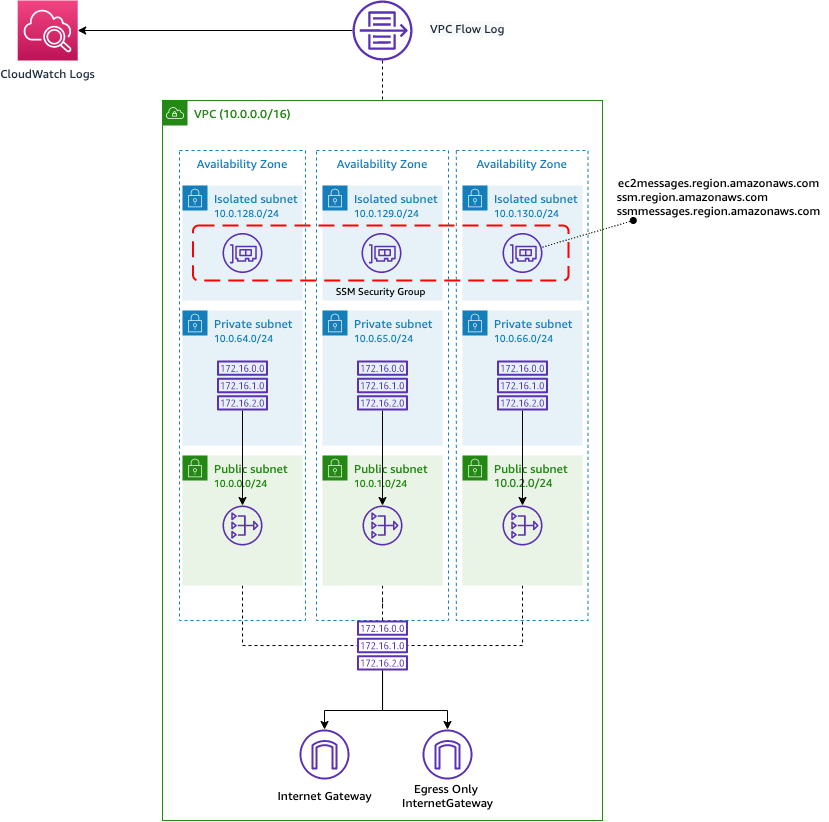

# VPC Wizard Cloudformation module

This Cloudformation module makes it easy and quick to deploy a VPC following best practises.

You can use the module by consuming it from a normal Cloudformation template as follows:

```
AWSTemplateFormatVersion: 2010-09-09
Description: Template consuming VPC Wizard module

Resources:
    MyVPC: 
      Type: AWSSamples::net::vpcwizard::MODULE
      Properties:
        CidrBlock: x.x.x.x/16
        NumberOfAZs: 1|2|3
        PrivateSubnetOutboundConnectivity: True|False
        VpcFlowLogDestination: None|CloudWatchLogs|S3
        EnablePrivateSessionManager: True|False
```

The module does the following things:

- creates a VPC with Private Subnets, Public Subnets and Isolated Subnets
- the VPC has the IPv4 CIDR specified in the template and an [Amazon-provided IPv6 range][1]
- the subnets are created in a number different AZs as per the `NumberOfAZs` parameter
- if `PrivateSubnetOutboundConnectivity=True` [NAT Gateways][2] and [EgressOnlyInternetGateways][3] are deployed so that the Private Subnets have outbound connectivity
- Isolated Subnets never have outbound connectivity (if `PrivateSubnetOutboundConnectivity=False` a Private Subnet behaves like an Isolated Subnet)
- if `VpcFlowLogDestination!=None` configures [VPC Flow Logs][4] (ALL Traffic) for the VPC with destination to either S3 or CloudWatchLogs
- if a `TransitGatewayId` is specified, the module creates a VPC attachment to the Transit Gateway in the Isolated Subnets
- if `EnablePrivateSessionManager=True` the module creates everything necessary for EC2 instances in any of the subnets (included Private and Isolated) to be managed remotely via AWS [Systems Manager Session Manager][5], without any requirement to provision internet connectivity to/from these subnets. In particular the module:
  - configures VPC endpoints for SSM/EC2 Messages in the Isolated Subnets
  - configures Security Groups for the above endpoints to allow TCP/443 from the entire CIDR range of the VPC
  - creates an instance role (`${AWS:StackName}/ssm-instance-profile`) that can be attached to any EC2 instance that should be managed via SSM Session Manaer


### Known limitations:

- `CidrBlock` length is fixed at `/16`
- The module creates VPC scaffolding in maximum 3 AZs (not more)

### Example:
The following template creates the infrastructure shown in the picture below:

```
AWSTemplateFormatVersion: 2010-09-09
Description: Template consuming VPC Wizard module

Resources:
    MyVPC: 
      Type: AWSSamples::net::vpcwizard::MODULE
      Properties:
        CidrBlock: 10.0.0.0/16
        NumberOfAZs: 3
        PrivateSubnetOutboundConnectivity: True
        VpcFlowLogDestination: CloudWatchLogs
        EnablePrivateSessionManager: True|False
```





[1]: https://docs.aws.amazon.com/vpc/latest/userguide/working-with-vpcs.html#vpc-associate-ipv6-cidr
[2]: https://docs.aws.amazon.com/vpc/latest/userguide/vpc-nat-gateway.html 
[3]: https://docs.aws.amazon.com/vpc/latest/userguide/egress-only-internet-gateway.html
[4]: https://docs.aws.amazon.com/vpc/latest/userguide/flow-logs.html
[5]: https://docs.aws.amazon.com/systems-manager/latest/userguide/session-manager.html